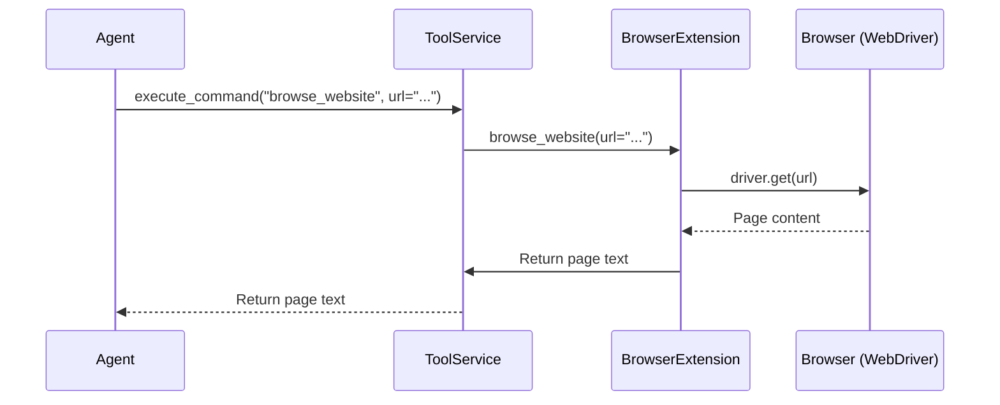
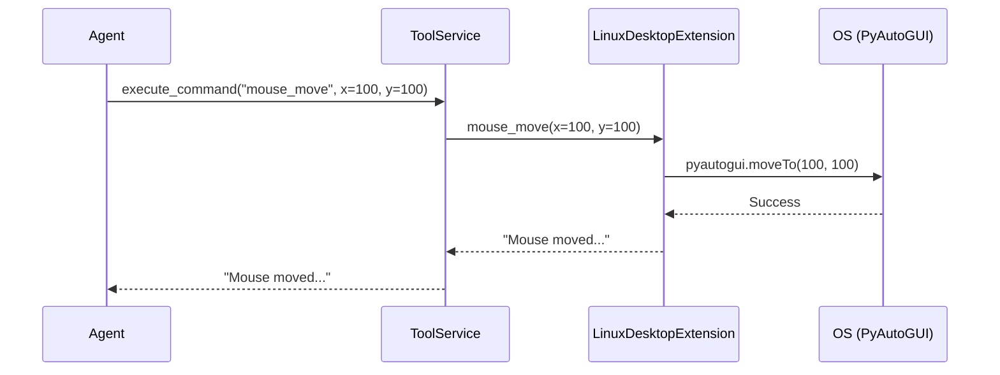
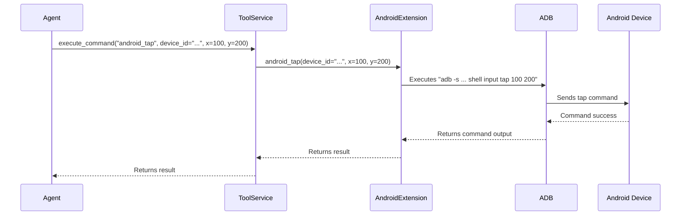
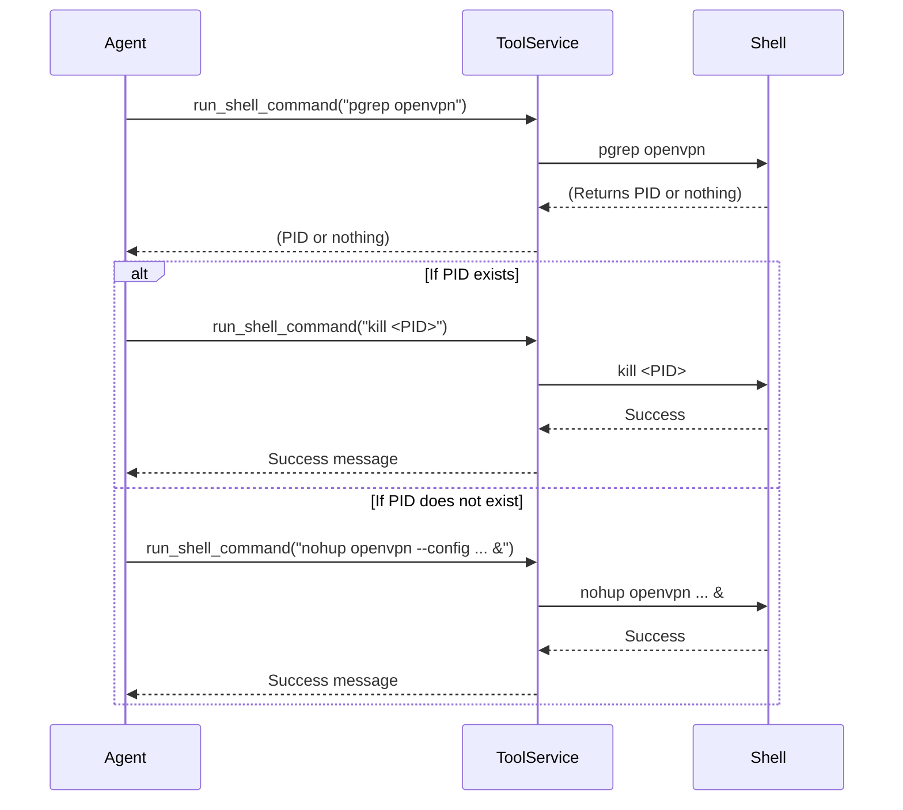

# LAS Core - New Agentic Capabilities: Browser, Desktop, and Android Control

## Overview

This document details the new agentic capabilities integrated into the LAS Core project. These features provide agents with the ability to perform complex tasks by controlling web browsers, Linux desktops, and Android devices. The new tools are designed to be robust, extensible, and to provide features for stealth and dynamic configuration.

---

## 1. Enhanced Browser Control (`BrowserExtension`)

The `BrowserExtension` provides a powerful interface for agents to interact with a web browser. It has been significantly refactored for performance and functionality, using a persistent browser instance to handle multi-step web automation tasks efficiently.

### Features

The extension exposes a rich set of commands for browser automation:

| Command | Description | Arguments |
| :--- | :--- | :--- |
| `browse_website` | Navigates to a URL and returns the page's text content. | `url: str` |
| `get_text` | Returns the text content of the current page. | *(None)* |
| `get_navigable` | Returns a list of all navigable links on the page. | *(None)* |
| `get_current_url` | Returns the current URL. | *(None)* |
| `click_element` | Clicks an element specified by its XPath. | `xpath: str` |
| `fill_form` | Fills out and submits a form. | `input_list: List[str]` |
| `get_form_inputs`| Returns a list of all visible input fields on the page. | *(None)* |
| `screenshot` | Takes a screenshot of the page. | *(None)* |
| `scroll_bottom` | Scrolls to the bottom of the page. | *(None)* |
| `set_geolocation`| Sets the browser's geolocation. | `latitude: float`, `longitude: float`, `accuracy: float` |
| `configure_stealth`| Restarts the browser with new stealth settings. | `timezone: str`, `resolution: Tuple`, `proxy_server: str` |

### How it Works

The extension is built on `Selenium` and `undetected-chromedriver`, which are powerful tools for browser automation that include features to avoid bot detection. The `BrowserExtension` manages a single, long-lived browser instance for each agent, which dramatically speeds up sequential operations.

**Stealth Features:** The `configure_stealth` command allows an agent to dynamically change its fingerprint by modifying settings like timezone, screen resolution, and proxy server. When called, it restarts the browser with these new settings applied.

### How to Use

An agent can call these commands through the `ToolService`.

**Example: Researching a topic**
1.  `tool_service.execute_command("browse_website", url="https://www.google.com/search?q=AI+in+2025")`
2.  `tool_service.execute_command("get_text")`
3.  `tool_service.execute_command("get_navigable")`
4.  The agent analyzes the links and decides which one to visit next.
5.  `tool_service.execute_command("browse_website", url="<chosen_link>")`

**Example: Changing browser fingerprint**
`tool_service.execute_command("configure_stealth", timezone="America/New_York", resolution=[1366, 768])`

### Use Cases

*   Automated information gathering and web scraping.
*   Filling out forms and interacting with web applications.
*   Automating social media tasks.
*   Testing web applications.

### Flow Diagram

---

## 2. Linux Desktop Control (`LinuxDesktopExtension`)

This new extension gives agents the ability to control a Linux desktop, allowing them to automate tasks in graphical user interfaces.

### Features

| Command | Description | Arguments |
| :--- | :--- | :--- |
| `mouse_move` | Moves the mouse to specific coordinates. | `x: int`, `y: int`, `duration: float` |
| `mouse_click` | Clicks the mouse at given coordinates. | `x: int`, `y: int`, `button: str` |
| `keyboard_type` | Types a string of text. | `text: str` |
| `take_screenshot`| Takes a screenshot and saves it to a file. | `filename: str` |

### How it Works

The extension uses the `pyautogui` library to programmatically control the mouse and keyboard. It directly interacts with the operating system's windowing server to simulate user actions.

### How to Use

An agent can use these commands to interact with any application running on the desktop.

**Example: Opening an application and typing**
1.  `tool_service.execute_command("mouse_click", x=50, y=50)` (Click on an application icon)
2.  *(Wait for app to load)*
3.  `tool_service.execute_command("keyboard_type", text="Hello, desktop!")`

### Use Cases

*   Automating desktop applications that do not have a command-line interface or API.
*   Performing actions in a graphical environment as part of a larger workflow.
*   Creating test automation for desktop software.

### Flow Diagram

---

## 3. Android Device Control (`AndroidExtension`)

This extension has been enhanced to provide more granular control over a connected Android device, which can be a physical device or an emulator/virtual device like Cuttlefish.

### Features

| Command | Description | Arguments |
| :--- | :--- | :--- |
| `android_list_devices`| Lists all connected Android devices. | *(None)* |
| `android_shell` | Executes a shell command on a device. | `device_id: str`, `command: str` |
| `android_screenshot` | Takes a screenshot of a device. | `device_id: str` |
| `android_tap` | Taps a specific coordinate on the screen. | `device_id: str`, `x: int`, `y: int` |
| `android_swipe` | Swipes from one point to another. | `device_id: str`, `x1`, `y1`, `x2`, `y2`, `duration_ms` |
| `android_type` | Types text into the focused input. | `device_id: str`, `text: str` |
| `android_press_key` | Presses a specific key code (e.g., 'HOME'). | `device_id: str`, `key_code: str` |

### How it Works

The extension is a wrapper around the Android Debug Bridge (`adb`) command-line tool. It constructs and executes `adb` commands using Python's `subprocess` module. It can connect to a remote `adb` server by configuring the `android_adb_host` and `android_adb_port` in the project settings, making it ideal for controlling cloud-based Android instances.

### How to Use

The agent must first know the `device_id` by calling `android_list_devices`. Then, it can issue commands to that device.

**Example: Unlocking phone and opening an app**
1.  `tool_service.execute_command("android_swipe", device_id="<id>", x1=500, y1=1500, x2=500, y2=500)` (Swipe up)
2.  `tool_service.execute_command("android_shell", device_id="<id>", command="input text 1234")` (Enter PIN)
3.  `tool_service.execute_command("android_press_key", device_id="<id>", key_code="ENTER")`
4.  `tool_service.execute_command("android_shell", device_id="<id>", command="am start -n com.example.app/com.example.app.MainActivity")`

### Use Cases

*   Automating mobile applications.
*   Testing Android apps and workflows.
*   Interacting with Android-specific settings and features.

### Flow Diagram

---

## 4. VPN and Location Spoofing Workflow

To enhance privacy and bypass geo-restrictions, a workflow has been designed for the agent to use a VPN. This is not a dedicated tool but a sequence of commands for the agent to execute using the built-in `run_shell_command` tool.

### How it Works

The agent uses `run_shell_command` to start and stop an `openvpn` process on the host machine. This routes all of the system's traffic, including the browser's, through the VPN.

### How to Use

**To Connect:**
1.  The agent needs the path to a valid `.ovpn` configuration file.
2.  The agent executes the command: `run_shell_command("nohup openvpn --config <path_to_config_file> &")` to start the VPN in the background.
3.  To confirm the connection and get the Process ID (PID), the agent can run: `run_shell_command("pgrep openvpn")`.

**To Disconnect:**
1.  The agent gets the PID of the `openvpn` process (if not already known) using `pgrep openvpn`.
2.  The agent executes the command: `run_shell_command("kill <PID>")`.

### Use Cases

*   Anonymizing web browsing and other network traffic.
*   Bypassing geographic restrictions on websites and services.
*   Enhancing the "stealth" of the web browsing agent.

### Flow Diagram

